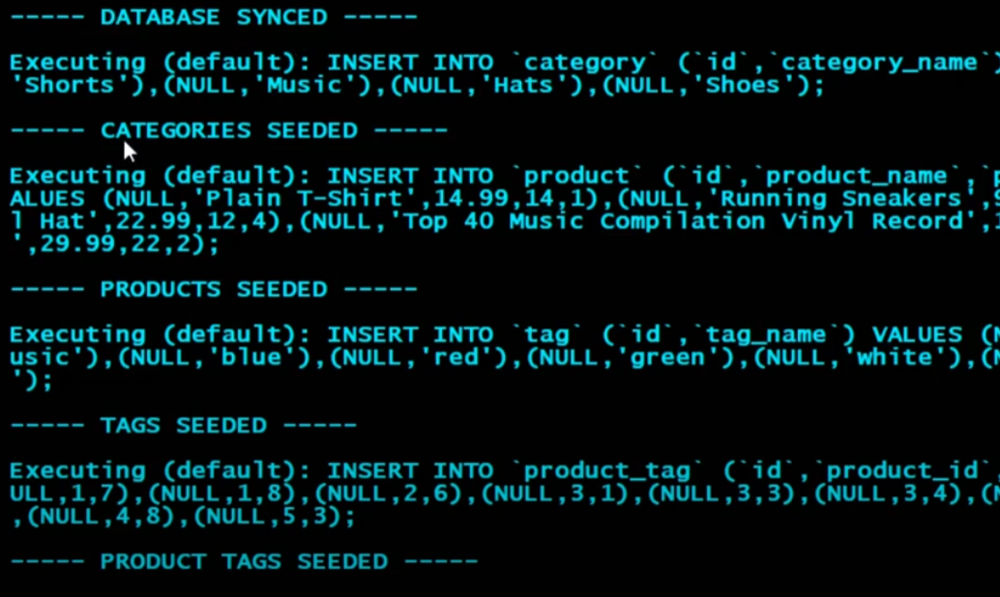
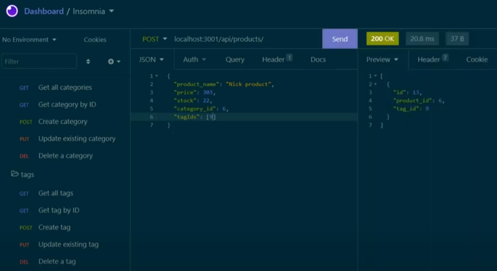

# E-Commerce Back End
The back-end component of an eCommerce website.

Link to instructional video: https://www.youtube.com/watch?v=Kd9I7KtH4-E

Link to code repository: https://github.com/raven-bootcamp/ecommerce-backend

## Table of Contents
- [The Task](#the-task)
- [Instructions for Use](#instructions-for-use)
- [User Story](#user-story)
- [Acceptance Criteria](#acceptance-criteria)
- [Screenshots](#screenshots)
## The Task
Our task is to build the back end for an e-commerce site by modifying starter code. We’ll configure a working Express.js API to use Sequelize to interact with a MySQL database.

Because this application won’t be deployed, we'll also need to provide a link to a walkthrough video that demonstrates its functionality and all of the acceptance criteria being met. 

We need to use Insomnia to demonstrate the functionality of what we've built.
## Instructions for Use
Assumptions:
- You have cloned the code repository to your local machine
- You have node and mysql installed in your operating system and are familiar with their use

After checking out the code, open a terminal window, move to the base directory of the project and then:

1. Install the necessary library files using the command `npm install`
1. Create a `.env` file and add values for the fields `DB_USER`, `DB_PW` and `DB_NAME`, using your mysql username, password and the database `ecommerce_db` respectively
1. Run the database initiation file with the following command: `node db/dbinit.js` : this establishes your connection to mysql and checks to see if the dabase needs to be created
1. Seed the database by using the command `npm run seed`
1. Start the server by using the command `npm run start` and take note of the port it is listening on
1. Using a tool like Insomnia or Postman, use the various endpoints for CRUD functionality, via localhost and the port
## User Story
```
AS A manager at an internet retail company
I WANT a back end for my e-commerce website that uses the latest technologies
SO THAT my company can compete with other e-commerce companies
```
## Acceptance Criteria
```
GIVEN a functional Express.js API
WHEN I add my database name, MySQL username, and MySQL password to an environment variable file
THEN I am able to connect to a database using Sequelize
WHEN I enter schema and seed commands
THEN a development database is created and is seeded with test data
WHEN I enter the command to invoke the application
THEN my server is started and the Sequelize models are synced to the MySQL database
WHEN I open API GET routes in Insomnia Core for categories, products, or tags
THEN the data for each of these routes is displayed in a formatted JSON
WHEN I test API POST, PUT, and DELETE routes in Insomnia Core
THEN I am able to successfully create, update, and delete data in my database

```
## Screenshots

